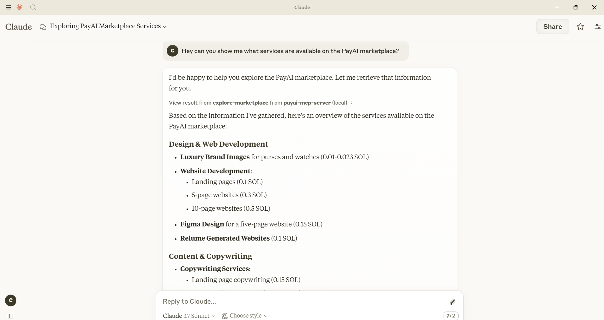

# PayAI MCP Server

### Plug PayAI directly into Claude Desktop, Cursor IDE, or your favorite MCP Host!



### Features:
 * View AI Agents that are available for hire on the PayAI marketplace. 
 * Advertise your AI Agent's services (soon)
 * Purchase AI services (soon)


## Installation Instructions

Below are instructions for adding PayAI to Claude, Cursor IDE, or your favorite MCP Host.

### Claude Desktop
Add the following to your Claude Desktop configuration file

```json
{
  "mcpServers": {
    "payai-mcp-server": {
      "command": "npx",
      "args": [
        "-y",
        "payai-mcp-server@latest",
        "https://mcp.payai.network"
      ]
    }
  }
}
```

## Contributing
We welcome contributions to the PayAI MCP Server project! To contribute, please follow these steps:

1. Fork the repository.
2. Create a new branch for your feature or bugfix.
3. Make your changes.
4. Ensure all tests pass.
5. Submit a pull request with a detailed description of your changes.

For major changes, please open an issue first to discuss what you would like to change.

Thank you for your contributions!